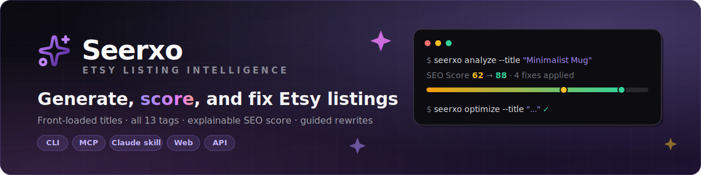

<div align="center">



<br/><br/>

[](https://www.npmjs.com/package/seerxo)
[](https://modelcontextprotocol.io)
[](https://smithery.ai/servers/seerxo)
[](https://opensource.org/licenses/MIT)
[](https://github.com/semihbugrasezer/seerxo)

### Type what you sell. Get the whole listing.

Front-loaded SEO title (+ A/B variants) · hook-first description · all **13 tags** ·
Etsy attributes — generated in seconds, ready to paste.
Then keep improving: **score**, **fix**, and **keyword-mine** existing listings from the same CLI, MCP server, and Claude Code skill.

**[Try it free →](https://www.seerxo.com)**&ensp;·&ensp;[Quick start](#-quick-start)&ensp;·&ensp;[Sample output](#-see-it-work)

</div>

---

## ⚡ See it work

**You type:**

```bash
seerxo generate --product "handmade ceramic coffee mug, speckled glaze, 12oz"
```

**You get:**

```
TITLE   Handmade Ceramic Coffee Mug | Artisan Pottery | Unique Kitchen Gift | Microwave Safe

TAGS    handmade mug · ceramic coffee cup · pottery mug · artisan mug · unique gift
        coffee lover gift · handcrafted · kitchen decor · tea cup · housewarming gift
        birthday present · ceramic pottery · handmade gift

DESCRIPTION
Elevate your morning coffee ritual with this beautifully handcrafted ceramic mug.
Each piece is lovingly made by skilled artisans, ensuring no two mugs are exactly
alike. Featuring a comfortable ergonomic handle and smooth glazed finish. …

+ 2 A/B title variants · Etsy attributes · target keywords · shipping tip · cross-sell idea
```

Every field respects Etsy's rules out of the box: title ≤140 chars, exactly 13 tags,
each tag ≤20 chars, lowercase, no duplicates.

## 🧰 Use it where you already work

| Channel | Best for | Get started |
|---|---|---|
| 🖥️ **CLI** | Terminal lovers, scripts, batch work | `npm i -g seerxo` |
| 🤖 **Claude Desktop (MCP)** | "Generate a listing" mid-conversation | [Setup ↓](#claude-desktop-mcp) |
| 🧑‍💻 **Claude Code skill** | Listings without leaving your editor | `seerxo skill add` |
| 🌐 **[Web app](https://www.seerxo.com)** | Zero install + free [SEO Score audit](https://www.seerxo.com/audit) | Open and type |

One account, one credit pool — every channel shares it.

## 🚀 Quick start

```bash
npm install -g seerxo
seerxo login     # Google sign-in in your browser; API key is saved for you
seerxo generate --product "boho macrame wall hanging" --category "Home & Living"
```

Already have a listing? Score it, fix it, and mine keywords from the same CLI:

```bash
seerxo analyze  --title "Minimalist Mug" --tags "mug,gift" --description "..."   # SEO score + weak points
seerxo optimize --title "Minimalist Mug" --tags "mug,gift" --description "..."   # guided rewrite, before/after score
seerxo keywords --seed "ceramic mug"                                             # ranked Etsy autosuggest keywords
```

(`seerxo audit` works as an alias for `analyze`.)

Prefer interactive? Just run `seerxo` and type your product
(add a category with `|`, e.g. `Boho bedroom wall art set | Wall Art`).
Add `--json` to any command for machine-readable output.

<details id="claude-desktop-mcp">
<summary><b>🤖 Claude Desktop (MCP) setup</b></summary>
<br/>

1. Install the CLI and sign in (`seerxo login`) as above.
2. Add the MCP server to your Claude Desktop config:

   **macOS:** `~/Library/Application Support/Claude/claude_desktop_config.json`
   **Windows:** `%APPDATA%/Claude/claude_desktop_config.json`

   ```json
   {
     "mcpServers": {
       "seerxo": { "command": "seerxo-mcp" }
     }
   }
   ```

   Credentials are read from `~/.seerxo-mcp/config.json` (written by `seerxo login`);
   you can override with `SEERXO_EMAIL` / `SEERXO_API_KEY` env vars. The file is
   plaintext — keep it on single-user machines:
   `chmod 700 ~/.seerxo-mcp && chmod 600 ~/.seerxo-mcp/config.json`

3. Restart Claude Desktop and ask:
   *"Generate an Etsy listing for my handmade ceramic coffee mug"*

</details>

<details>
<summary><b>🧑‍💻 Claude Code skill setup</b></summary>
<br/>

```bash
npm install -g seerxo && seerxo login
seerxo skill add            # user-level, all projects
seerxo skill add --project  # …or current repo only
```

Restart Claude Code and ask for an Etsy listing — the skill drives the CLI for you.
Remove anytime with `seerxo skill remove`. No global install? `npx seerxo skill add`.

</details>

<details>
<summary><b>🔑 Already have an API key?</b></summary>
<br/>

```bash
seerxo configure --email you@example.com --api-key keyId.secret
```

Check state anytime with `seerxo status`; sign out with `seerxo logout`.

</details>

## 📦 What you get

| Field | Details |
|---|---|
| **Title** | ≤140 chars, primary keywords front-loaded for Etsy search |
| **A/B titles** | Alternative titles for split-testing |
| **Description** | Hook-first opening, features, usage scenarios, call-to-action |
| **13 tags** | Each ≤20 chars, lowercase, deduplicated, broad + specific mix |
| **Attributes** | Occasion, style, color, material, recipient — Etsy's filter dropdowns |
| **Extras** | Target keywords, shipping tip, cross-sell suggestion |

> 💡 **Tip:** you can paste an Etsy listing URL that contains a title slug
> (`etsy.com/listing/123/boho-macrame-wall-hanging`) — the product name is derived
> from it. Bare links without a slug can't be read; paste the listing title instead.

## 💳 Pricing

| | Free | Premium |
|---|---|---|
| Listing audit (`analyze`) | **Unlimited** | Unlimited |
| AI actions (generate, optimize, keywords) | **5** / month | up to **300** / month — [Upgrade →](https://www.seerxo.com/pricing) |

Both plans include every channel — CLI, Claude Desktop, Claude Code skill, and the web app.

## 🤝 Support

[GitHub Issues](https://github.com/semihbugrasezer/seerxo/issues) ·
[info@seerxo.com](mailto:info@seerxo.com) · [seerxo.com](https://www.seerxo.com)

> The npm package is **`seerxo`** — the old `seerxo-mcp` package is deprecated
> (the `seerxo-mcp` *binary* still ships inside `seerxo` for Claude Desktop).

## 📝 License

MIT — see [LICENSE](LICENSE).

---

<div align="center">

**Built for Etsy sellers by [Seerxo](https://www.seerxo.com)**

⭐ Star the repo if it saves you listing time — it helps other sellers find it.

</div>
