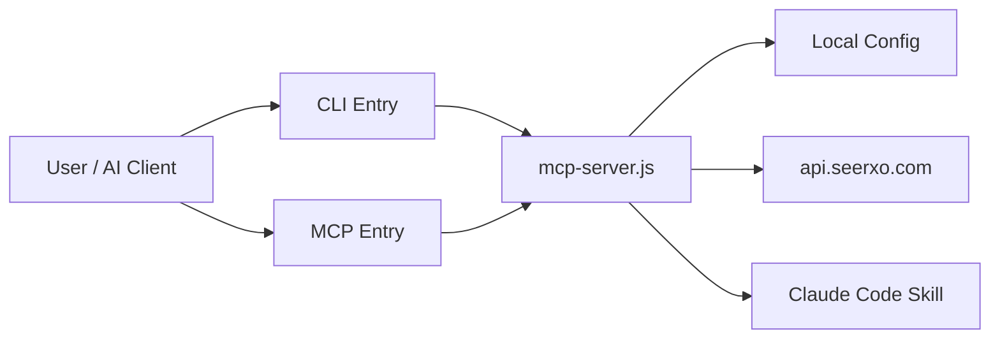

# Seerxo System Map

Architecture map for the Seerxo npm package: CLI, MCP stdio server, Claude Code skill, and API client. Update this file only on architectural changes (see AGENTS.md).

## Runtime flow

## Component ownership

| Component | Responsibility |
| --- | --- |
| `bin/seerxo.js` | Select CLI, interactive or MCP mode |
| `bin/seerxo-mcp.js` | Start Seerxo as an MCP stdio server |
| `mcp-server.js` | Runtime orchestration: CLI commands, MCP JSON-RPC, auth, API client, result formatting, skill installer |
| `utils.js` | API host validation and normalization |
| `skills/seerxo-etsy-seo/` | Claude Code integration |
| `~/.seerxo-mcp/config.json` | Local credentials (email, API key, host) — secret |
| `api.seerxo.com` | Authentication, quota and SEO operations (external) |

## MCP tools → backend endpoints

| MCP tool | CLI command | Endpoint |
| --- | --- | --- |
| `generate_etsy_seo` | `generate` | `POST /mcp/generate` |
| `seerxo_analyze_listing` | `analyze` | `POST /v1/analyze` |
| `seerxo_optimize_listing` | `optimize` | `POST /v1/optimize` |
| `seerxo_suggest_keywords` | `keywords` | `POST /v1/keywords` |

Other endpoints: `GET /mcp/quota` (quota check), `POST /auth/mcp/login` + `/auth/mcp/confirm` (CLI login flow). All must match the published API spec (https://seerxo.com/openapi.yaml).

## Architecture rules

1. `bin/` files must remain thin entrypoints.
2. The npm package must not access the database directly — only the public API.
3. API keys must never be logged.
4. New API endpoints and MCP tools must be documented here.
5. Product logic should gradually move out of `mcp-server.js`.
